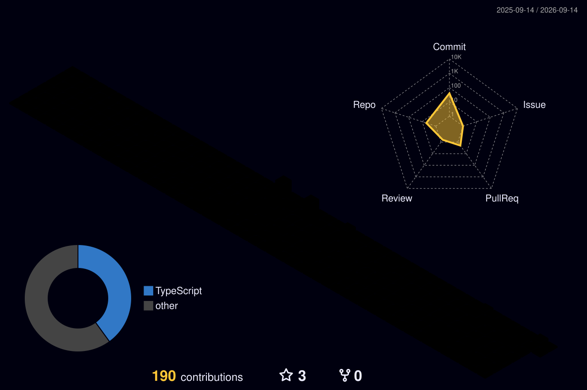

<!--
  ============================================================
  PROFILE README — affanminhas
  This file MUST live in a repo named exactly: affanminhas
  Path: affanminhas/README.md  (root of the default branch)
  ============================================================
-->

<!-- ===== HEADER / TYPING BANNER ===== -->

 

---

## 👋 About me

- 🇵🇰 Software engineer from **Pakistan**, currently building at **[Blocship](https://github.com/affanminhas)**
- 📱 I work mostly in **Flutter / Dart** — cross-platform apps that feel native on both sides
- 🐍 Also comfortable in **Python**, and I like small tools that solve one problem well
- 🌱 Currently going deep on **HisaabYaar (e.g. Flutter architecture, state management, backend with Supabase)**
- ✍️ I write at **[Medium](https://medium.com/@affansultan901)**
- 🤝 Open to collaborating on **open-source Flutter packages** and **developer tooling**
- 📫 Reach me: **affansultan901@email.com** · DM on [WhatsApp](https://api.whatsapp.com/send/?phone=923152044437&text&type=phone_number&app_absent=0)

> 💡 *Ask me about Flutter widget performance, Dart async, or why your `setState` isn't rebuilding.*

---

## 🛠️ Tech Stack

<!--
  Edit the `i=` list above — ONLY put what you actually use.
  A short honest list beats a long fake one. Recruiters check.
  Full icon list: https://skillicons.dev
-->

---

## 📌 Featured Projects

<table>
<tr>
<td width="120" align="center">
  
</td>
<td>

### [HisaabYaar](https://github.com/affanminhas/hisaabyaar-web)

One-line description of what it does and who it's for.

</td>
</tr>
</table>

<!--
  Swap these for your BEST repos once you've cleaned them up.
  Same repos should also be set as Pinned on your profile page.
-->

---

## 📊 GitHub Stats

  

  

---

## 🐍 Contribution Graph

<!-- Generated by the snake workflow — see .github/workflows/snake.yml -->
<picture>
  <source media="(prefers-color-scheme: dark)" srcset="https://raw.githubusercontent.com/affanminhas/affanminhas/output/github-contribution-grid-snake-dark.svg" />
  <source media="(prefers-color-scheme: light)" srcset="https://raw.githubusercontent.com/affanminhas/affanminhas/output/github-contribution-grid-snake.svg" />
  
</picture>

  

<!-- Generated by the 3D contrib workflow — see .github/workflows/profile-3d.yml -->

---

**If something here helped you, a ⭐ on the repo goes a long way.**

